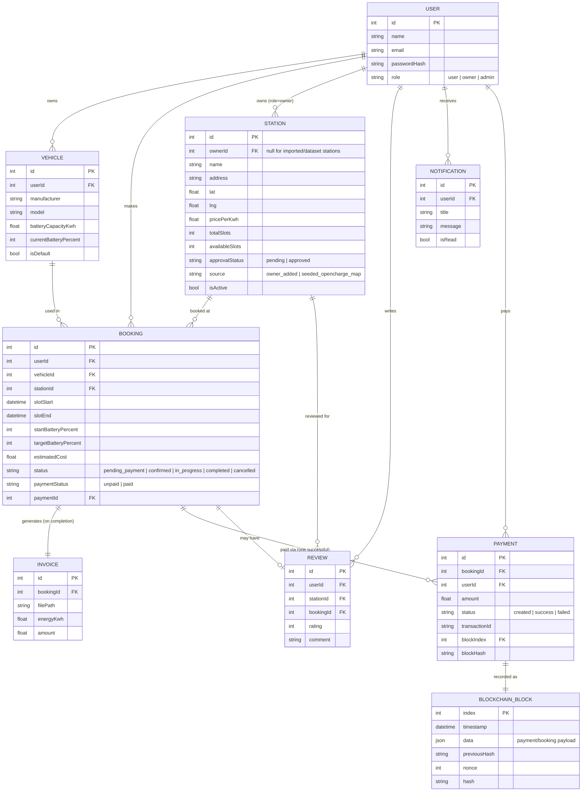

# Entity-Relationship Diagram

Data lives in Firebase Firestore as flat collections (`users`, `vehicles`,
`stations`, `bookings`, `reviews`, `notifications`, `invoices`, `payments`,
`blockchain_blocks`), each document holding a numeric, auto-incrementing
`id` plus foreign-key fields (e.g. a booking document stores `userId`,
`stationId`, `vehicleId`). The relationships below are enforced in
application code rather than by a schema, which is normal for a document
database — this diagram shows the *logical* relational shape.

Paste this file's Mermaid block into <https://mermaid.live> for an
interactive view, or view it directly on GitHub, which renders Mermaid
fenced code blocks natively.
